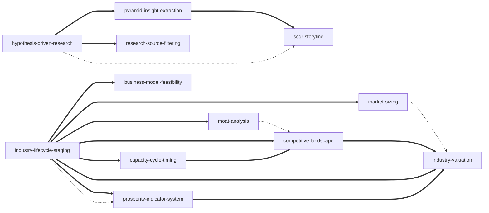

# 《如何快速了解一个行业》— Skill Index

> 本书由 cangjie-skill 蒸馏, 共产出 **12** 个 skills。
> 处理时间: 2026-08-12

## 关于这本书

- **作者**: 肖璟
- **出版年**: 2025-08
- **一句话主旨**: 以**产业生命周期**为核心框架,用渗透率划分行业所处阶段,按阶段确定分析重点(导入期看可行性、成长期看规模性、成熟期看防守性与盈利性),再叠加估值、外部因素与景气度跟踪,系统判断一个行业的投资价值。
- **整书理解**: 见 [BOOK_OVERVIEW.md](./BOOK_OVERVIEW.md)
- **精华长文** (不读全书看这篇): [DIGEST.md](./DIGEST.md)
- **术语词典**: [GLOSSARY.md](./GLOSSARY.md)

---

## Skill 列表 (按主题分组)

### 框架篇 — 判断一个行业值不值得研究 (投资/决策视角)

- [`industry-lifecycle-staging`](./industry-lifecycle-staging/SKILL.md) — 用渗透率判定行业处于导入/成长/成熟/衰退哪一阶段,并按阶段确定研究重点。全书入口。
- [`business-model-feasibility`](./business-model-feasibility/SKILL.md) — 两步法评估早期商业模式:销售可行性(时间/空间对标+频次弹性)+ 利润可行性(UE 模型+终局视角)。
- [`market-sizing`](./market-sizing/SKILL.md) — TAM/SAM/SOM 三口径 + 需求/供给/供需匹配三法测算市场规模,把未知量拆成易得已知量。
- [`moat-analysis`](./moat-analysis/SKILL.md) — 护城河只有两种构造(资源垄断+网络效应),成本优势只是结果;用客户决策/购买/使用三环节检查客户关系护城河。
- [`competitive-landscape`](./competitive-landscape/SKILL.md) — 横向(集中度)+纵向(议价)两维分析行业格局,含集中度先降后升、成熟期投最赚钱环节等规律。
- [`capacity-cycle-timing`](./capacity-cycle-timing/SKILL.md) — 产能周期四阶段 + 顶底信号(外来者扩产=顶、龙头减产=底、资本开支比<1.5=底),周期行业择时。
- [`industry-valuation`](./industry-valuation/SKILL.md) — 相对估值(行业PE÷全A)隔离宏观噪音 + 生命周期各阶段估值特征 + 赔率概率 + 交易拥挤度 + 预期差。
- [`prosperity-indicator-system`](./prosperity-indicator-system/SKILL.md) — 构建高频景气度指标体系(前瞻+同步两类,纵向产业链+横向类别两条路径),持续验证中长期判断。

### 方法篇 — 怎么研究一个行业 (通用研究能力)

- [`hypothesis-driven-research`](./hypothesis-driven-research/SKILL.md) — 研究底层方法论:假设→MECE 拆解→验证子假设;深度差是持续创造财富的唯一可靠前提。
- [`research-source-filtering`](./research-source-filtering/SKILL.md) — 评估与交叉验证资讯源:研报四思路、报喜不报忧即信号、专家访谈纪律、数据口径与立场检查。
- [`pyramid-insight-extraction`](./pyramid-insight-extraction/SKILL.md) — 金字塔四步从资讯中提炼核心观点,用 So what 追问区分"总结"与"提炼"。
- [`scqr-storyline`](./scqr-storyline/SKILL.md) — SCQR 故事线输出,按四类受众调整顺序(路人CQSR/观众SCQR/大老板RSCQ/直属领导R)。

---

## 引用图



图例:

- `===>` composes-with(配合使用)
- `-.->` contrasts-with(对比,按情境选一)

### 关系说明

- **入口**: `industry-lifecycle-staging` 是唯一无依赖的入口 skill。判定阶段后,按阶段组合调用下游:导入期→`business-model-feasibility`;成长期→`market-sizing`;成熟期→`moat-analysis` + `competitive-landscape`(+`capacity-cycle-timing`);全程可配 `industry-valuation`(终局估值)与 `prosperity-indicator-system`(持续跟踪)。
- **方法链**: `hypothesis-driven-research`(研究)→ `research-source-filtering`(选源)→ `pyramid-insight-extraction`(提炼)→ `scqr-storyline`(表达)。解题归解题、沟通归沟通,研究链与表达链顺序相反。
- **对比对**: `moat-analysis`(个体壁垒)vs `competitive-landscape`(行业格局);`market-sizing`(盘子大小)vs `industry-valuation`(定价倍数);`industry-lifecycle-staging`(长期阶段)vs `prosperity-indicator-system`(短期景气);`capacity-cycle-timing`(中期结构)vs `prosperity-indicator-system`(高频跟踪)。

---

## 推荐学习顺序

(从依赖图的叶子节点开始, 向上)

1. **industry-lifecycle-staging** — 最基础, 无前置, 全书入口。
2. **business-model-feasibility** — 依赖生命周期(导入期判定)。
3. **market-sizing** — 依赖生命周期(成长期判定)。
4. **moat-analysis** — 依赖生命周期 + 可行性(先活下来再谈守住)。
5. **competitive-landscape** — 依赖生命周期 + 产能周期。
6. **capacity-cycle-timing** — 依赖生命周期(确认成熟期周期化)。
7. **industry-valuation** — 依赖生命周期 + 竞争格局(盈利性)。
8. **prosperity-indicator-system** — 依赖生命周期 + 假设驱动。
9. **hypothesis-driven-research** — 通用研究底层, 随时可学。
10. **research-source-filtering** — 组合于假设驱动(选源)。
11. **pyramid-insight-extraction** — 依赖假设驱动(研究后提炼)。
12. **scqr-storyline** — 依赖金字塔(提炼后表达)。

---

## 安装使用

本目录是构建产物, 宿主不会从这里加载 skill。要让 agent 真正调用, 把 skill 目录复制到宿主的 skills 目录:

```bash
# 用户级 (所有项目可用)
for d in industry-lifecycle-staging business-model-feasibility market-sizing moat-analysis competitive-landscape capacity-cycle-timing industry-valuation prosperity-indicator-system hypothesis-driven-research research-source-filtering pyramid-insight-extraction scqr-storyline; do
  cp -r "$d" ~/.claude/skills/
done

# 或项目级
cp -r <skill-slug> <project>/.claude/skills/    # Claude Code
cp -r <skill-slug> <project>/.cursor/skills/    # Cursor
```

---

## 接入 darwin-skill

所有 skill 均带有 `test-prompts.json` (darwin-skill 兼容格式), 可直接接入自动进化:

```
darwin evolve books/ruhe-kuaisu-liaojie-yige-hangye/
```

---

## 审计轨迹

- 候选单元池: [candidates/](./candidates/)
- 被淘汰的候选 (含原因): [rejected/](./rejected/)
- 三重验证通过单元: [verified.md](./verified.md)
- BOOK_OVERVIEW: [BOOK_OVERVIEW.md](./BOOK_OVERVIEW.md)
